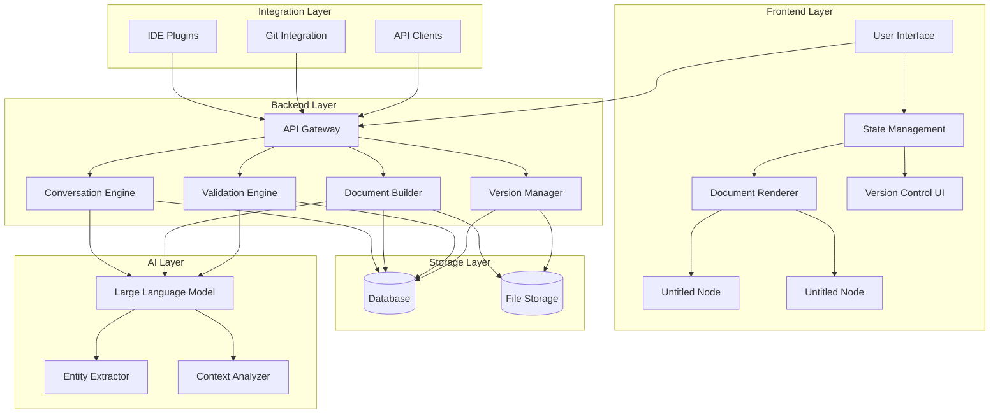

# Fixed Mermaid Diagram Example

## What Was Fixed:

1. **Removed the `---` config block** - This can cause parsing issues
2. **Replaced compound arrows** - Changed `UI --> StateManager & API` to separate lines
3. **Simplified subgraph names** - Used descriptive names instead of `subGraph0`, `subGraph1`, etc.
4. **Maintained the same visual structure** - The diagram looks identical but uses compatible syntax
